```{r setup, include=FALSE}
options(htmltools.dir.version = FALSE)
knitr::opts_chunk$set(messagwese=FALSE, warning = FALSE)
xaringanthemer::style_mono_accent(base_color ="#23395b", 
                                  title_slide_text_color="#23395b", 
                                  title_slide_background_color = "#fbf9f4", 
                                  background_color = "#fbf9f4", 
                                  link_color =  "#C93312")

options(htmltools.dir.version = FALSE)
knitr::opts_chunk$set(message=FALSE, warning = FALSE, error=TRUE, echo=FALSE, cache=TRUE)
```

```{r style-share-again, echo=FALSE}
xaringanExtra::use_tile_view()
xaringanExtra::use_panelset()

#xaringanExtra::style_share_again(
#  share_buttons = c("twitter", "linkedin", "pocket")
#)
```

name: about-me
layout: false
class: about-me-slide, inverse, middle, center


## .red[About me]


### Tiago Ventura

### Researcher Civic Integrity at Twitter

.fade[PhD Candidate at University of Maryland, College Park]

[`r icons::simple_icons("twitter")` @TiagoVentura_](https://twitter.com/_Tiagoventura)
[`r icons::simple_icons("github")` TiagoVentura](https://github.com/TiagoVentura)
[`r icons::ionicons("mail")` venturat@umd.edu](venturat@umd.edu)
[`r icons::ionicons("link-outline")`https://tiagoventura.rbind.io/](https://tiagoventura.rbind.io/)

---

class: middle

# Plans for Talk

- **An overview of our research agenda and methods at the iLCSS**

- **Truth be told: Cognitive moderators of selective sharing of fact-checks on social media**

---
### iLCSS: Social Science meets Data

.panelset[

.panel[.panel-name[iLCSS]


**Truth be Told**  is one of the many projects I have been working as a member of the [Interdisciplinary Lab for Computational Social Science](https://ilcss.umd.edu/) at UMD

Before we start, I want to say a few words about how this project fits in our broader mission at iLCSS. 

At iLCSS we replicate a logic quite strong on hard-science labs: most of our work is collaborative and involves several co-authors. So I want to thanks my co-authors on this paper:

- Natalia Aruguete (UnQ), Ernesto Calvo (UMD), Ingrid Bachman (Puc-Chile), Sebastian Valenzuela (Puc-Chile)

- And *Chequeado*

]

.panel[.panel-name[People]

.pull-left[
.center[
```{r out.width="60%"}

```

```{r out.width="60%"}

```

]]

.pull-left[
.center[
```{r out.width="60%"}
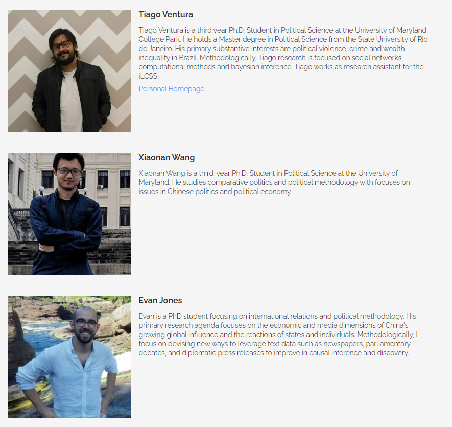
```

```{r out.width="60%"}
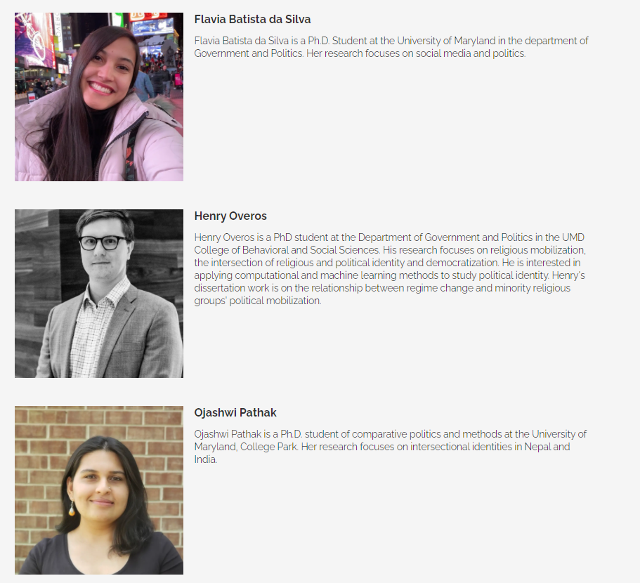
```

]]
]

.panel[.panel-name[Our Approach]

.center[]

.pull-left[
.center[**Big Data + Computational Modelling**

```{r out.width="90%"}
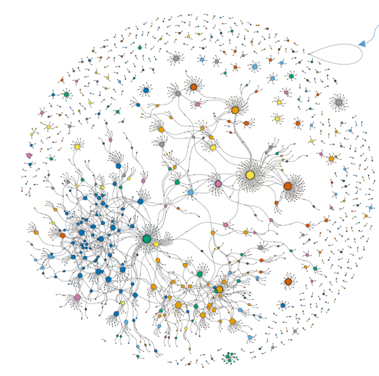
```
]
]


.pull-right[
.center[**Small On-line Experiments**

```{r out.width="60%"}

```
]
]


.panel[.panel-name[Our Research]

Under this umbrella, I have worked on a few different projects focusing on substantive issues in the midst of communications, political behavior, and computational social science:

- News Sharing on Social-Media: Papers [Here](https://www.tandfonline.com/doi/abs/10.1080/21670811.2020.1852094) and [Here](https://tiagoventura.rbind.io/files/News_by_popular_demand_II.pdf)

- Framing, Activation and Social Media Echo-Chambers: Papers [Here]() and [Here](https://tiagoventura.rbind.io/files/Event_Adjudication_in_Social_Media.pdf)

- Behavioral Effects of Social Media: [Trust](https://www.econstor.eu/handle/10419/237464) and [Risk Related to Covid-19](https://www.cambridge.org/core/journals/latin-american-politics-and-society/article/abs/will-i-get-covid19-partisanship-social-media-frames-and-perceptions-of-health-risk-in-brazil/496B0EE199D8079AC6B9467BCF0EB08C)

- Strategies to work with Big Social Media Network Data: [The Path-Weighted Regression Model](https://methods.sagepub.com/book/research-methods-in-political-science-and-international-relations/i4823.xml)

]
]
]

---
class:middle, center, inverse

## Truth be told: Cognitive moderators of selective sharing of fact-checks on social media


---
## A Glimpse of the Literature

--

Previous work have discussed several reasons why people share misinformation:

- Partisan-Sharing and Negative Partisanship (Guess, Nagler, & Tucker 2019; Osmundsen et. al. 2021)

- Lack of Cognitive Sophistication (Pennycock and Rand 2019)

- Digital Literacy (Guess, Nagler & Tucker 2019)

- Polarization, Highly Partisan Media Outlets (Faris et al 2017; Eldridge 2017)


---

### Fact-Checking 

Fact-checkers have become ubiquitous to most media companies. Several recent scholarly work on the effects of fact-checking correction:

- Fact-checking overall reduces misperceptions (Walter et al 2020, Wood and Porter, 2021, Nyhan et. al. 2020).

- Little Evidence of back-fire effect (Wood and Porter, 2019).

---
class: middle

While we have enough evidence for the effects of corrections on attitudes, less is known considering the effects of corrections on behavior on-line. Particularly, investigations on cognitive moderators of sharing corrections.

- Users prefer to share pro-attitudinal corrections (Ekstrom & Lai, 2020, Lewendosky et al., 2012)

- Partisans consult congenial sources to adjudicate between true/false (Peterson and Iyengar, 2020)


---
class: middle, inverse


### When do users share fact-checks with their peers?

#### .red[What are the main cognitive moderators of the decision to share corrections?]

---
class: middle


.pull-left-narrow[

#### .red[Hypothesis] 

]

.pull-right-wide[

- *H1: Attitude-consistent fact-checks are more likely to be shared than counter-attitudinal fact-checks.*

- *H2: Attitude-consistent fact-checks rated ‘true’ are more likely to be shared than attitude-consistent fact-checks rated ‘false.’*
] 

---

class:middle, center, inverse

## Research Design


---
### Research Design: Experiment + Social Media Data

<br><br>

Our paper combines two distinct empirical approaches:

- .red[On-line Experiment] ~> Two Stage, Two Arm Experiment, where respondents are assigned to True/False Fact-Checking Corrections. 

- .red[Observational data] ~> Social media from Twitter + a regression discontinuity design. 


---

### Experimental Design: General Flow


.center[
```{r}
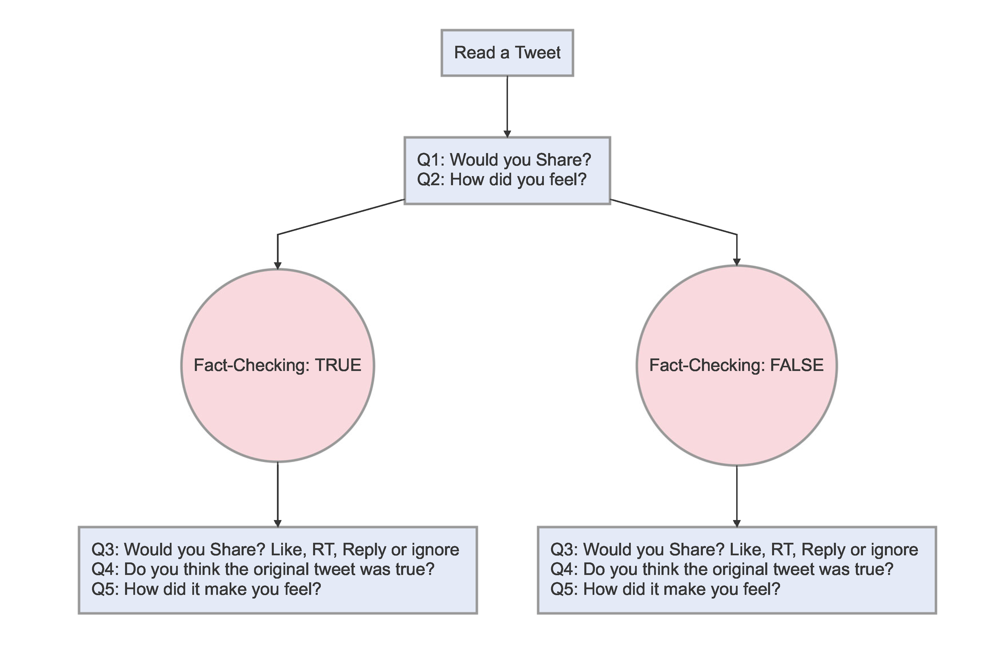
```
]

---
### Experimental Design: With Images


.pull-left[

.center[
<br>
```{r out.width="80%"}

```

And we do the same with a tweet congruent to Macri voters (Ofelia Case)

]
]
.pull-right[

.center[
```{r out.width="50%"}
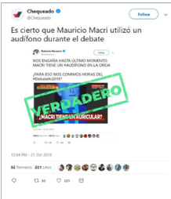
```


```{r out.width="50%"}
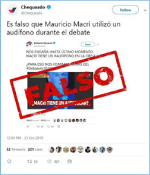
```
]
]

---
### Experimental Design and Hypotheses

<br><br>

.center[**Would you share?**]
```{r}
library(kableExtra)
library(tidyverse)
library(formattable)
library(extrafont)

d <- read.csv("hyp.csv")

d <- d %>%
      mutate(TRUE.=ifelse(str_detect(TRUE., "Pro"), 
                                  cell_spec(TRUE., "html", 
                                            color =  "darkgreen", bold = T),                                          TRUE.)) %>%
     mutate(FALSE.=ifelse(str_detect(FALSE., "Pro"), 
                                  cell_spec(FALSE., "html", 
                                            color =  "#C93312", bold = T),                                          FALSE.)) %>%
   mutate(TRUE..1=ifelse(str_detect(TRUE..1, "Pro"), 
                                  cell_spec(TRUE..1, "html", 
                                            color =  "darkgreen", bold = T),                                          TRUE..1)) %>%
     mutate(FALSE..1=ifelse(str_detect(FALSE..1, "Pro"), 
                                  cell_spec(FALSE..1, "html", 
                                            color =  "#C93312", bold = T),                                          FALSE..1))

d<-d %>%
  set_names(~c("Vote Choice", "Tweet", "True", "False", "Tweet_2", "True_Tw2", "False_Tw2"))

d %>%
 kable("html", escape = F) %>%
  kable_styling("hover", font_size = 14,
                # font_size = 12,
                full_width = T) %>% 
  column_spec(1, bold=T, width = '1.5in') %>%
   add_header_above(c(" "=1, "Audifono" = 3, "Ofelia" = 3))

```


---
class:middle, center, inverse

## Results


---

### H1: Pro-Attitudinal Effects

.panelset.sideways[

.panel[.panel-name[Pro-Fernandez]

.center[
```{r out.width="80%"}
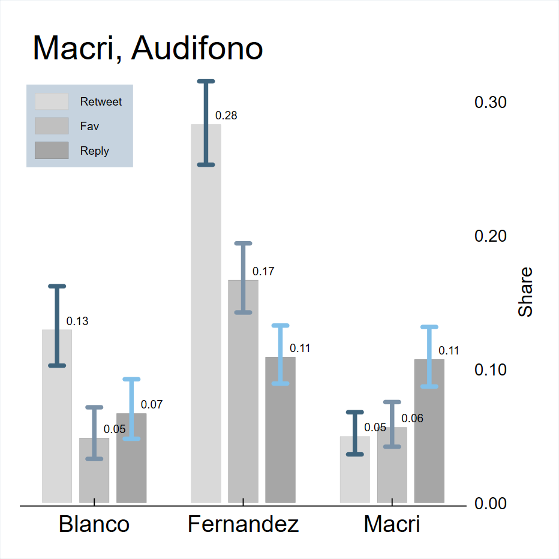
```
]
]

.panel[.panel-name[Pro-Macri]
.center[
```{r out.width="100%"}
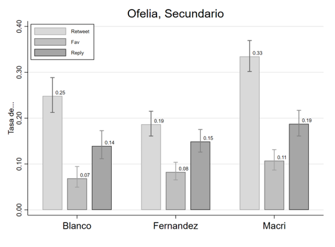
```
]
]
]

---

### H2: Pro-Attitudinal Confirmation

.panelset.sideways[

.panel[.panel-name[Pro-Fernandez]

.center[
```{r out.width="60%"}
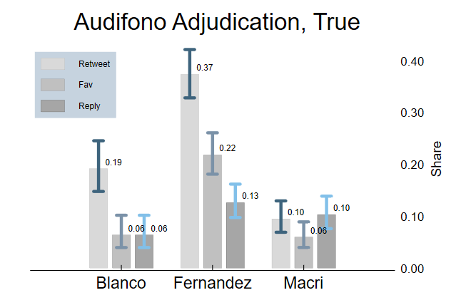
```

```{r out.width="60%"}
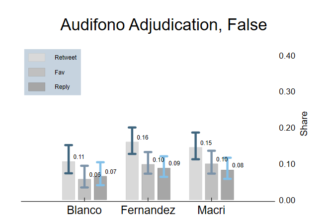
```


]
]

.panel[.panel-name[Full-Models]

.center[
```{r out.width="100%"}
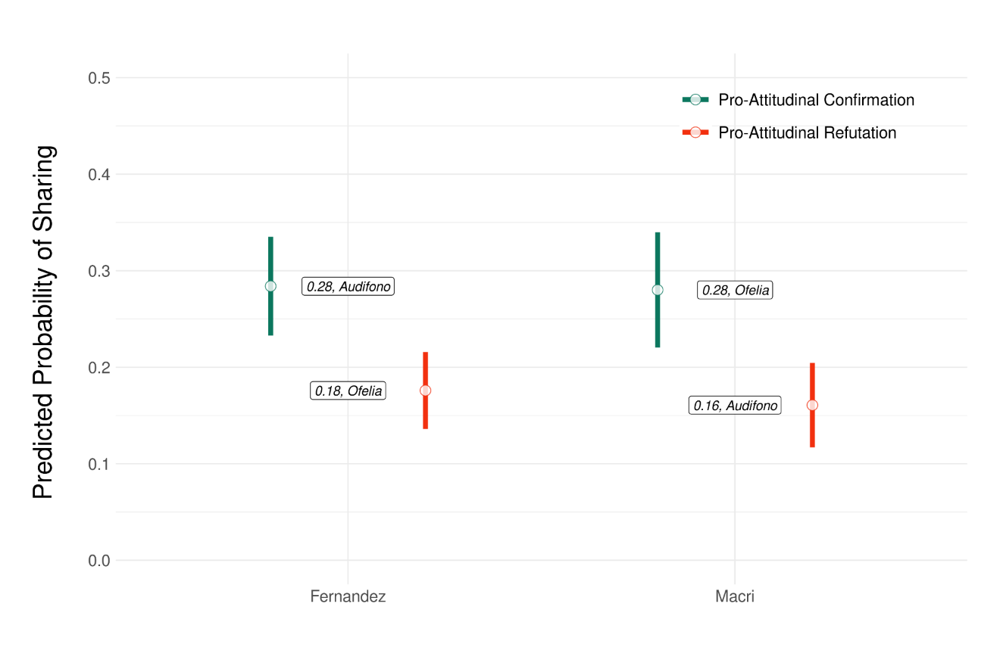
```
]
]

.panel[.panel-name[Latency]

.center[
```{r out.width="80%"}
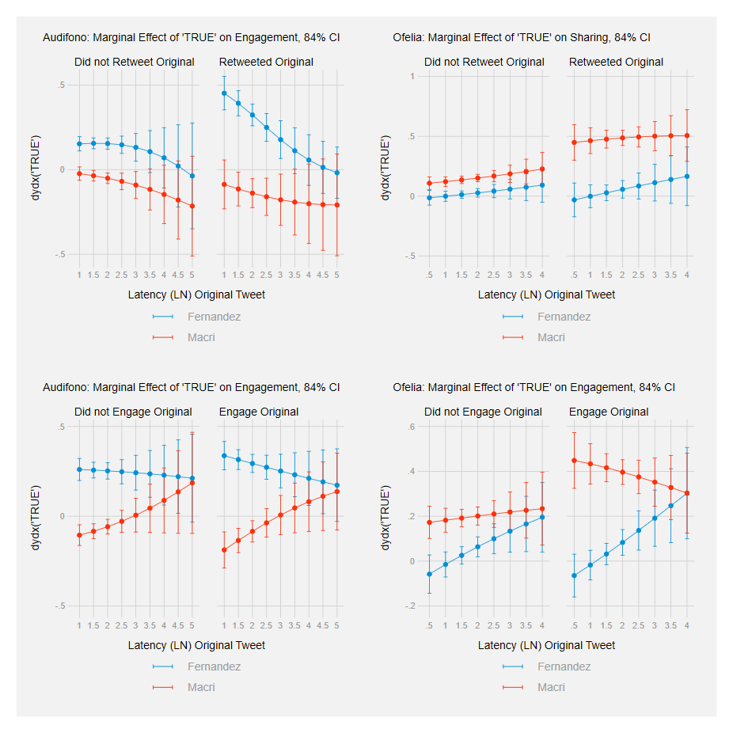
```


]

]


]

---
class:center, middle, inverse

### Observational Social Media Data

---

### Modeling the activation of Fact-Checkers

<br><br>
Our experiment provided evidence of selective sharing of .red[‘true’] and .red[‘false’] fact-checks.

To assess the robustness of experimental findings, we introduce supporting evidence of **partisan selective sharing** as stated in H1 using real-world social media data.

We focus on the **false rumor** that Macri was using a ear device (*audifono*) during the debate

---
### Research Design

<br><br>

Using the Twitter APIs we collected close to .red[3 million] Tweets during the two weeks around the debate.

- Filtered only **retweets** 

- Searched for the *audifono* misinformation (simple regex search)

- Employed **Community Detection algorithms** to identify Pro-Macri and Anti-Macri

Using the exact time of the Chequeado Correction (False), we estimated the causal effects (.red[Regression Discontinuity Design]) of the intervention on users' reaction (time-to-retweet)


---

### Results: Time-to-Retweet after the Correction

.panelset.sideways[

.panel[.panel-name[Discontinuity Visually]

.center[
```{r out.width="100%"}
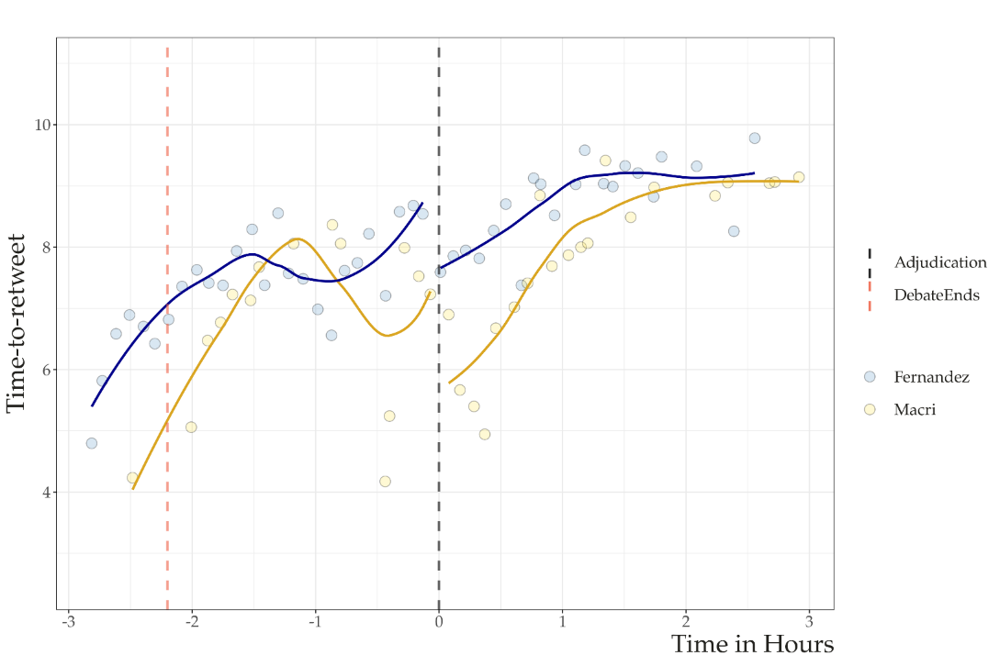
```

]
]

.panel[.panel-name[Rd Robust Point-Estimates]

.center[
```{r out.width="100%"}
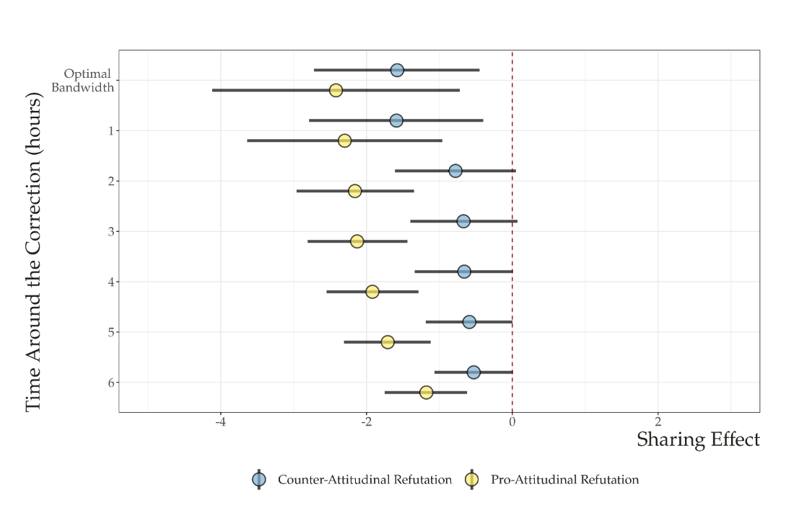
```
]
]
]

---

### Conclusion

<br><br><br>

.panelset.sideways[

.panel[.panel-name[Research Findings]


- Users exhibit .red[partisan reasoning] when sharing corrections. 

- More important,  a pro-attitudinal fact-check labeled .red[true] is more likely to be shared on social media than an equally congenial fact-check labeled .red[false]

- This result suggests that sharing fact-checking messages is regulated by the .red[hot cognition] and confirmatory bias (directional goals driven by automatic responses)

]

.panel[.panel-name[Policy Implications]


#### .red[Fact-checkers should consider presenting their work with a ‘true’ adjudication more often]

]
]

---
class:inverse, middle, center

## Thank you!

