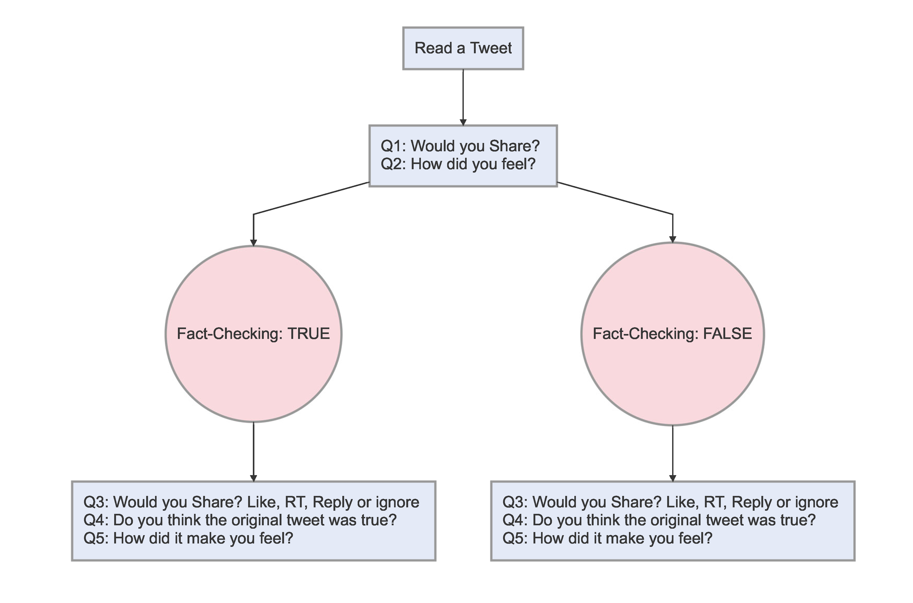
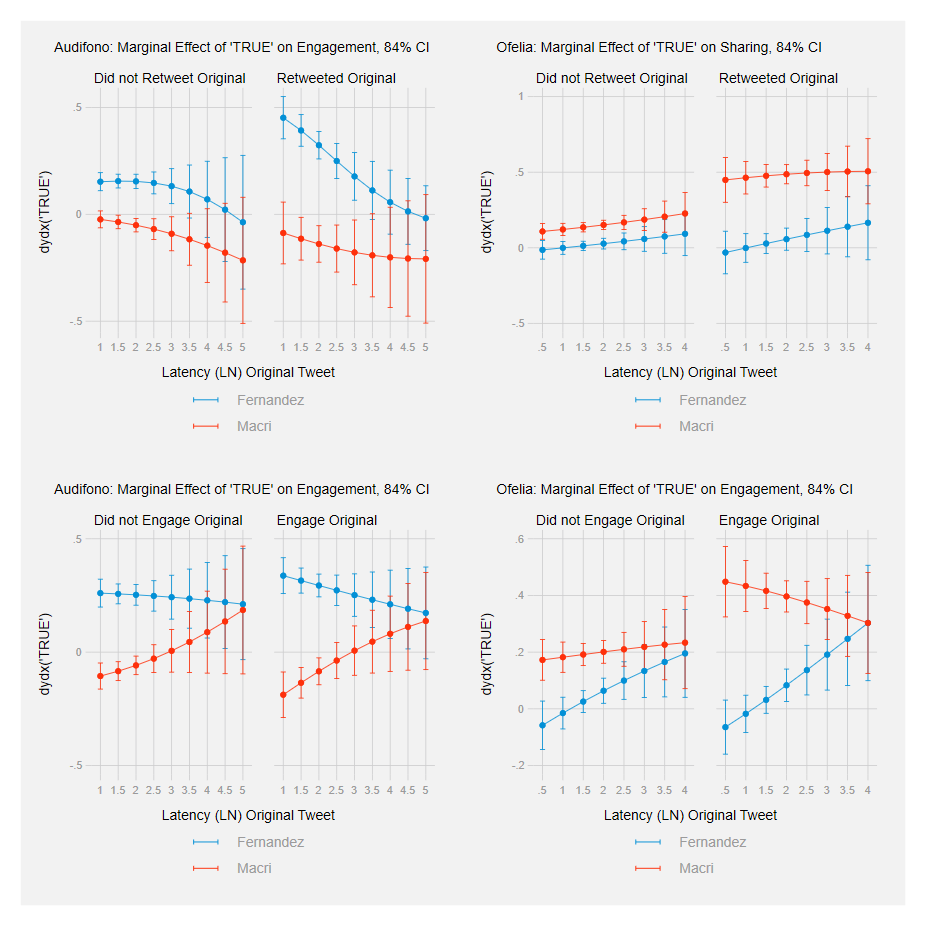

```{r setup, include=FALSE}
options(htmltools.dir.version = FALSE)
knitr::opts_chunk$set(messagwese=FALSE, warning = FALSE)
xaringanthemer::style_mono_accent(base_color ="#23395b", 
                                  title_slide_text_color="#23395b", 
                                  title_slide_background_color = "#fbf9f4", 
                                  background_color = "#fbf9f4", 
                                  link_color =  "#C93312")

options(htmltools.dir.version = FALSE)
knitr::opts_chunk$set(message=FALSE, warning = FALSE, error=TRUE, echo=FALSE, cache=TRUE)
```

```{r style-share-again, echo=FALSE}
xaringanExtra::use_tile_view()
xaringanExtra::use_panelset()

#xaringanExtra::style_share_again(
#  share_buttons = c("twitter", "linkedin", "pocket")
#)
```

class: middle, inverse

### When do users share fact-checks with their peers?

#### .red[What are the main cognitive moderators of the decision to share corrections?]

---
class: middle


.pull-left-narrow[

#### .red[Hypothesis] 

]

.pull-right-wide[

- *H1: Attitude-consistent fact-checks are more likely to be shared than counter-attitudinal fact-checks.*

- *H2: Attitude-consistent fact-checks rated ‘true’ are more likely to be shared than attitude-consistent fact-checks rated ‘false.’*
] 

---

class:middle, center, inverse

## Research Design


---
### Research Design: Experiment + Social Media Data

<br><br>

Our paper combines two distinct empirical approaches:

- .red[On-line Experiment] ~> Two Stage, Two Arm Experiment, where respondents are assigned to True/False Fact-Checking Corrections. 

- .red[Observational data] ~> Social media from Twitter + a regression discontinuity design. 


---

### Experimental Design: General Flow


.center[
```{r}

```
]

---
### Experimental Design: With Images I

.pull-left[

.center[
<br>
```{r out.width="80%"}
knitr::include_graphics("figs/macri_aud.png")
```

]
]
.pull-right[

.center[
```{r out.width="50%"}
knitr::include_graphics("figs/true.png")
```


```{r out.width="50%"}
knitr::include_graphics("figs/false.png")
```
]
]

---

### Experimental Design: With Images I

.pull-left[

.center[
<br>
```{r out.width="80%"}

```

]
]
.pull-right[

.center[
```{r out.width="50%"}
knitr::include_graphics("figs/of_true.png")
```


```{r out.width="50%"}

```
]
]


---
### Experimental Design and Hypotheses

<br><br>

.center[**Would you share?**]
```{r}
library(kableExtra)
library(tidyverse)
library(formattable)
library(extrafont)

d <- read.csv("hyp.csv")

d <- d %>%
      mutate(TRUE.=ifelse(str_detect(TRUE., "Pro"), 
                                  cell_spec(TRUE., "html", 
                                            color =  "darkgreen", bold = T),                                          TRUE.)) %>%
     mutate(FALSE.=ifelse(str_detect(FALSE., "Pro"), 
                                  cell_spec(FALSE., "html", 
                                            color =  "#C93312", bold = T),                                          FALSE.)) %>%
   mutate(TRUE..1=ifelse(str_detect(TRUE..1, "Pro"), 
                                  cell_spec(TRUE..1, "html", 
                                            color =  "darkgreen", bold = T),                                          TRUE..1)) %>%
     mutate(FALSE..1=ifelse(str_detect(FALSE..1, "Pro"), 
                                  cell_spec(FALSE..1, "html", 
                                            color =  "#C93312", bold = T),                                          FALSE..1))

d<-d %>%
  set_names(~c("Vote Choice", "Tweet", "True", "False", "Tweet_2", "True_Tw2", "False_Tw2"))

d %>%
 kable("html", escape = F) %>%
  kable_styling("hover", font_size = 14,
                # font_size = 12,
                full_width = T) %>% 
  column_spec(1, bold=T, width = '1.5in') %>%
   add_header_above(c(" "=1, "Audifono" = 3, "Ofelia" = 3))

```


---
class:middle, center, inverse

## Results


---

### H1: Pro-Attitudinal Effects

.panelset.sideways[

.panel[.panel-name[Audifono]

.center[
```{r out.width="80%"}
knitr::include_graphics("./figs/TW1.png")
```
]
]

.panel[.panel-name[Ofelia]
.center[
```{r out.width="100%"}
knitr::include_graphics("./figs/TW2.png")
```
]
]
]

---

### H2: Effects of Correction, Macri

.panelset.sideways[

.panel[.panel-name[True]

.center[
```{r out.width="100%"}
knitr::include_graphics("./figs/true_audifono.png")
```


]
]

.panel[.panel-name[False]

.center[

```{r out.width="100%"}
knitr::include_graphics("./figs/false_audifono.png")
```

]
]
]

---

### H2: Effects of Correction, Ofelia

.panelset.sideways[

.panel[.panel-name[True]

.center[
```{r out.width="100%"}

```


]
]

.panel[.panel-name[False]

.center[

```{r out.width="100%"}

```

]
]
]

---
## Results: Models

```{r out.width="80%"}
knitr::include_graphics("./figs/pred_prob.png")
```

---

## Results: Latency


.center[
```{r out.width="65%"}

```

]

---
class:center, middle, inverse

### Observational Social Media Data

---
### Research Design

<br><br>

Using the Twitter APIs we collected close to .red[3 million] Tweets during the two weeks around the debate.

- Filtered only **retweets** 

- Searched for the *audifono* misinformation (simple regex search)

- Employed **Community Detection algorithms** to identify Pro-Macri and Anti-Macri

Using the exact time of the Chequeado Correction (False), we estimated the causal effects (.red[Regression Discontinuity Design]) of the intervention on users' reaction (time-to-retweet)


---

### Results: Time-to-Retweet after the Correction

.panelset.sideways[

.panel[.panel-name[Discontinuity Visually]

.center[
```{r out.width="100%"}
knitr::include_graphics("./figs/rd_graph.png")
```

]
]

.panel[.panel-name[Rd Robust Point-Estimates]

.center[
```{r out.width="100%"}
knitr::include_graphics("./figs/rd_point.png")
```
]
]
]

---

### Conclusion

<br><br><br>

.panelset.sideways[

.panel[.panel-name[Research Findings]


- Users exhibit .red[partisan reasoning] when sharing corrections. 

- More important,  a pro-attitudinal fact-check labeled .red[true] is more likely to be shared on social media than an equally congenial fact-check labeled .red[false]

- This result suggests that sharing fact-checking messages is regulated by the .red[hot cognition] and confirmatory bias (directional goals driven by automatic responses)

]

.panel[.panel-name[Policy Implications]


#### .red[Fact-checkers should consider presenting their work with a ‘true’ adjudication more often]

]
]

---
class:inverse, middle, center

## Thank you!

